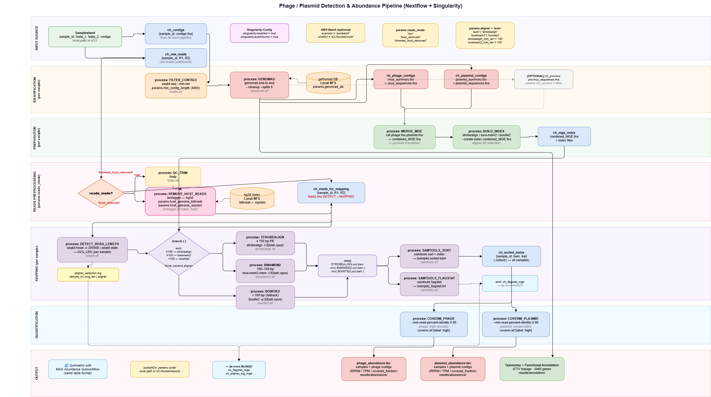
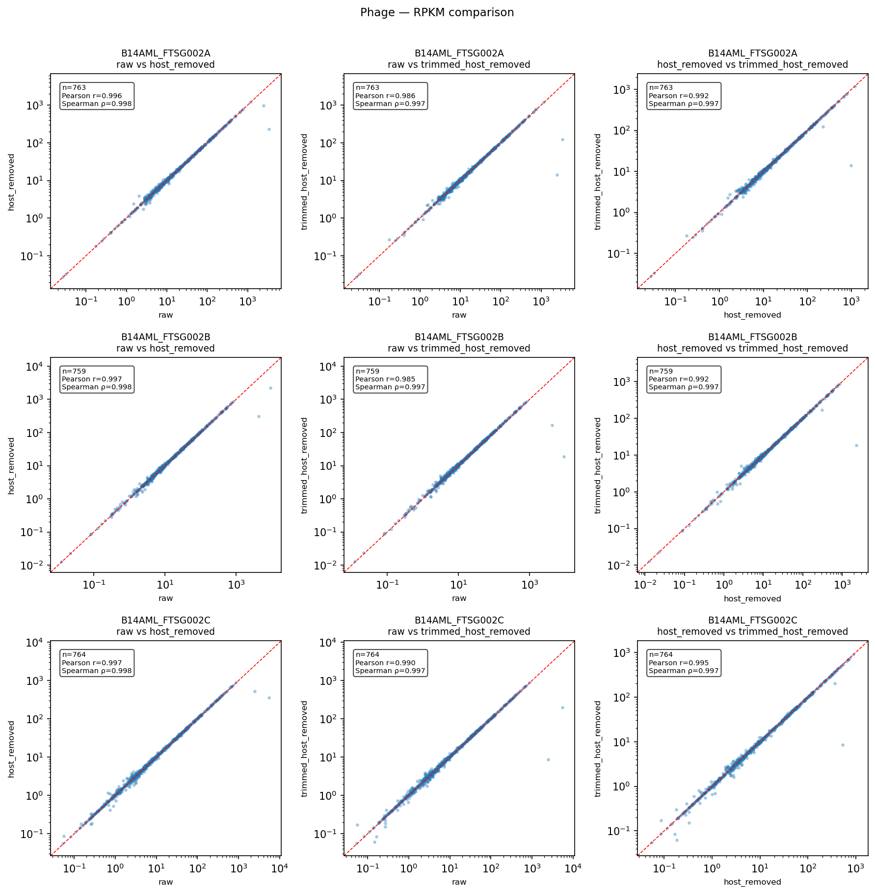
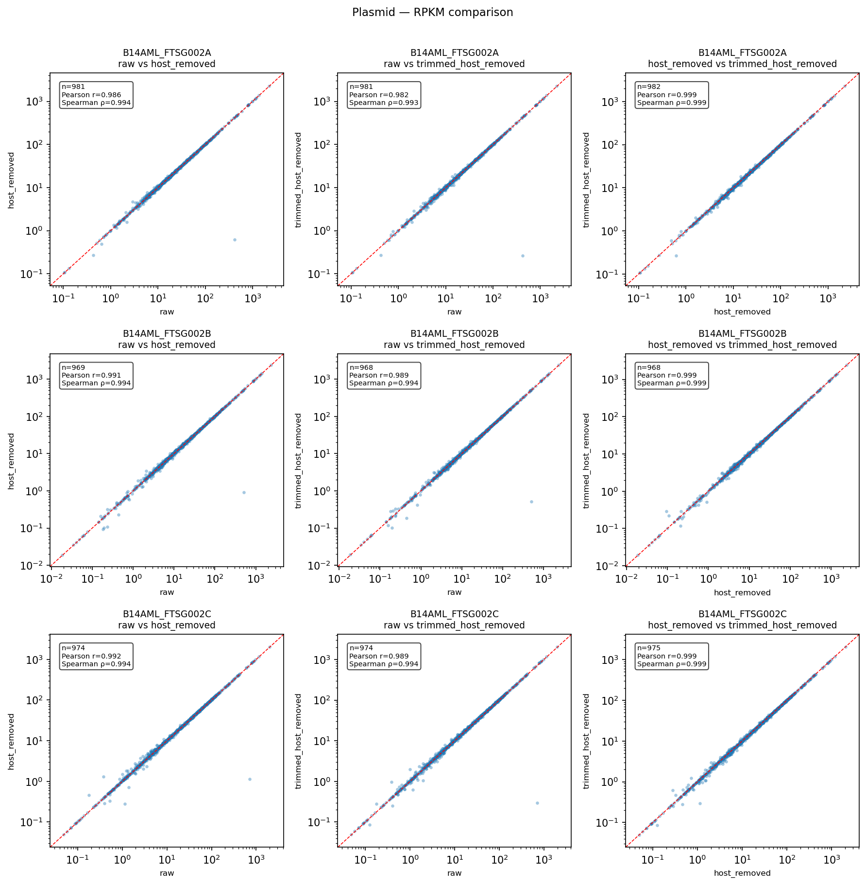

# Phage / Plasmid Detection & Abundance Pipeline

A **Nextflow + Singularity** subworkflow for detecting bacteriophage and plasmid sequences from metagenomic data and quantifying their abundance across samples.

> **Upstream dependency:** contigs are provided by an existing de novo pipeline (MEGAHIT, per-sample). This subworkflow takes contigs + raw reads as input — it does **not** perform QC or assembly.

---

## Pipeline Overview



---

## Requirements

| Tool | Version | Purpose |
|---|---|---|
| Nextflow | ≥ 23.04.0 | Workflow engine |
| Singularity / Apptainer | ≥ 3.8 / 1.0 | Container runtime |
| Java | ≥ 11 | Required by Nextflow |
| Python | ≥ 3.8 | Samplesheet validation only |

---

## Quick Start

```bash
# 1. Validate your samplesheet
python pipeline/bin/validate_samplesheet.py my_samples.csv

# 2. Run (raw reads, auto aligner)
nextflow run pipeline/main.nf \
    -profile singularity \
    --input      my_samples.csv \
    --genomad_db /nfs/databases/genomad_db/ \
    --outdir     ./results \
    --sif_dir    /containers/sif
```

See [docs/install.md](docs/install.md) for full installation, database setup, and Singularity image build instructions.

---

## Inputs

### Samplesheet

```csv
sample_id,fastq_1,fastq_2,contigs
sample_A,/data/A_R1.fastq.gz,/data/A_R2.fastq.gz,/data/A_contigs.fna
sample_B,s3://bucket/B_R1.fastq.gz,s3://bucket/B_R2.fastq.gz,s3://bucket/B_contigs.fna
```

- `sample_id`: unique identifier (alphanumeric, `-`, `_`)
- `fastq_1/2`: raw reads (local path or `s3://`)
- `contigs`: per-sample assembly from de novo pipeline (local or `s3://`)

### Key Parameters

| Parameter | Default | Description |
|---|---|---|
| `--input` | — | Path to samplesheet CSV |
| `--genomad_db` | — | Path to geNomad DB directory (NFS mount) |
| `--outdir` | `./results` | Output directory |
| `--sif_dir` | `/containers/sif` | Directory containing `.sif` files |
| `--reads_mode` | `raw` | `raw` / `host_removed` / `trimmed_host_removed` |
| `--host_genome_bitmask` | — | Absolute path to hg38 `.bitmask` FILE (bmtagger) |
| `--host_genome_srprism` | — | Absolute path to srprism index PREFIX, e.g. `/nfs/hg38_bmtagger/hg38.srprism` |
| `--singularity_bind_paths` | `null` | Comma-separated NFS/FSx paths to bind into containers, e.g. `/fsx` or `/nfs,/scratch`. Required when `singularity.autoMounts` cannot detect your mount point |
| `--fastp_extra_args` | `''` | Extra fastp flags appended to QC_TRIM (e.g. `'--cut_right --length_required 50'`). If changed, delete `results/.bmtagger_storeDir/trimmed_host_removed/` to invalidate the bmtagger cache |
| `--aligner` | `auto` | `auto` / `strobealign` / `bwamem2` / `bowtie2` |
| `--min_contig_length` | `4000` | Minimum contig length before geNomad |
| `--run_provirus` | `false` | Enable provirus detection |
| `--coverm_min_identity_phage` | `0.85` | CoverM identity threshold for phage |
| `--coverm_min_identity_plasmid` | `0.90` | CoverM identity threshold for plasmid |

---

## Outputs

```
results/
├── pipeline_info/
│   ├── timeline.html          # per-process wall-time Gantt chart
│   ├── report.html            # resource usage (CPU, memory, I/O) per task
│   ├── trace.tsv              # raw task-level metrics
│   └── dag.html               # pipeline DAG
├── genomad/{sample_id}/
│   ├── {sample_id}_virus_summary.tsv
│   ├── {sample_id}_plasmid_summary.tsv
│   ├── {sample_id}_virus_sequences.fna
│   └── {sample_id}_plasmid_sequences.fna
├── annotation/
│   └── {sample_id}_genomad_annotation.tsv
├── abundance/
│   ├── phage_abundance.tsv       # samples × phage contigs (RPKM, TPM, covered_fraction)
│   └── plasmid_abundance.tsv
└── logs/
    ├── aligner_selection.log     # sample_id | avg_len | aligner_used
    └── {sample_id}_flagstat.txt
```

---

## Singularity Images

Definition files are in `pipeline/singularity/` with naming convention `toolName_version.def` → `toolName_version.sif`.

```bash
# Build all images
for def in pipeline/singularity/*.def; do
    sudo singularity build /containers/sif/$(basename $def .def).sif $def
done
```

| Image | Version |
|---|---|
| seqkit_2.8.1.sif | seqkit 2.8.1 |
| genomad_1.8.0.sif | geNomad 1.8.0 |
| fastp_0.23.4.sif | fastp 0.23.4 |
| bmtagger_3.306.sif | BMTagger 3.306 |
| strobealign_0.13.0.sif | strobealign 0.13.0 |
| bwamem2_2.2.1.sif | bwa-mem2 2.2.1 |
| bowtie2_2.5.3.sif | Bowtie2 2.5.3 |
| samtools_1.19.2.sif | SAMtools 1.19.2 |
| coverm_0.7.0.sif | CoverM 0.7.0 |

---

## Testing

### 1. Validate samplesheet (Python, no tools needed)

```bash
pytest tests/validate_samplesheet/
```

### 2. Stub tests — channel logic only (Nextflow, no Singularity)

```bash
python tests/generate_test_data.py          # generate synthetic FASTA + FASTQ

cd pipeline
nf-test test ../tests/modules/
nf-test test ../tests/subworkflows/
```

### 3. Full integration test (requires Singularity + built images)

```bash
nextflow run pipeline/main.nf \
    -profile singularity,test \
    --sif_dir /containers/sif \
    --genomad_db /nfs/databases/genomad_db/
```

### 4. AWS FSx for Lustre integration test

When running on AWS with FSx for Lustre as the shared filesystem, choose an EC2 instance
based on the `reads_mode` being tested:

#### Without host removal (`reads_mode = 'raw'`)

| Instance | vCPU | RAM | ~Cost/hr | Rationale |
|---|---|---|---|---|
| `m6i.2xlarge` | 8 | 32 GB | $0.38 | Sufficient for geNomad (medium label: 16 CPU / 32 GB) + aligners + CoverM |
| `m6i.4xlarge` | 16 | 64 GB | $0.77 | Preferred when running multiple samples concurrently |

#### With host removal (`reads_mode = 'host_removed'` or `trimmed_host_removed`)

The bmtagger bitmask index (~16 GB) must fit in memory alongside the running process,
requiring at least 24 GB RAM headroom dedicated to the `REMOVE_HOST_READS` step.

| Instance | vCPU | RAM | ~Cost/hr | Rationale |
|---|---|---|---|---|
| `r6i.2xlarge` | 8 | 64 GB | $0.50 | **Recommended first choice** — memory-optimised, 64 GB covers bmtagger bitmask + OS overhead; 12.5 Gbps network suits large FSx reads |
| `r6i.4xlarge` | 16 | 128 GB | $1.01 | Use when running ≥ 3 samples in parallel or when adding a safety margin for concurrent geNomad runs |

> **Why r6i over r5?** The r6i series uses Intel Ice Lake, delivering ~15 % better
> single-core performance and higher memory bandwidth — important when the bmtagger
> bitmask is streamed from FSx on every process invocation.

#### FSx-specific configuration

```bash
# Mount point is typically /fsx on the instance
# Bind it into every Singularity container so database files are visible
nextflow run pipeline/main.nf \
    -profile singularity,awsbatch \
    --input            s3://your-bucket/samples.csv \
    --genomad_db       /fsx/databases/genomad_db/ \
    --host_genome_bitmask /fsx/databases/hg38_bmtagger/hg38.bitmask \
    --host_genome_srprism /fsx/databases/hg38_bmtagger/hg38.srprism \
    --sif_dir          /fsx/containers/sif \
    --outdir           s3://your-bucket/results \
    --singularity_bind_paths '/fsx'
```

> **Recommended test strategy**: start with `r6i.2xlarge` + `reads_mode = 'raw'` to
> validate FSx mounting, Singularity, and channel logic end-to-end without needing the
> bmtagger database. Once that passes, rerun with `reads_mode = 'host_removed'` and
> the full hg38 index to validate the high-memory path.

---

## Benchmark

Tested on **EC2 r6i.xlarge** (4 vCPU / 32 GB RAM), 3 samples (`B14AML_FTSG002A/B/C`), on-demand pricing ~$0.252/hr (us-east-1).
Resources capped to 4 CPU / 24 GB via `test_local.config` for local testing; production should use `r6i.2xlarge` or larger with the default `base.config`.

**Input size per sample:** reads ~4.5 GB compressed FASTQ (paired-end), contigs ~149 MB FASTA (pre-assembled by MEGAHIT).

### Per-module timing

Measured from `pipeline_info/trace.tsv` (raw mode) and `storeDir` file timestamps (GENOMAD).
`host_removed` and `trimmed_host_removed` columns will be updated once those runs complete.

| Module | `raw` | `host_removed` | `trimmed_host_removed` | Notes |
|---|---|---|---|---|
| FILTER_CONTIGS | 1–3 s × 3 | 1–3 s × 3 | 1–3 s × 3 | parallel across samples |
| **GENOMAD** | **~72 min total** (first run only) | storeDir skip | storeDir skip | sequential: ~28 / 24 / 19 min per sample; shared storeDir across all modes |
| MERGE_MGE | <1 s × 3 | <1 s × 3 | <1 s × 3 | |
| BUILD_INDEX | ~3 s × 3 | ~3 s × 3 | ~3 s × 3 | |
| QC_TRIM (fastp) | — | — | 3m 53s–4m 41s × 3 | trimmed_host_removed only; sequential |
| **REMOVE_HOST_READS (bmtagger)** | — | **2h 14m / 2h 43m / 3h 18m** | **2h 8m / 2h 36m / 3h 16m** | bottleneck; sequential; hg38 bitmask ~24 GB RAM |
| DETECT_READ_LENGTH | ~2.3 s × 3 | ~0.9 s × 3 | ~0.9 s × 3 | parallel; faster after host removal |
| STROBEALIGN | 6–8 min × 3 | 3m 45s–5m 23s × 3 | 3m 41s–5m 15s × 3 | sequential; fewer reads after host removal |
| SAMTOOLS_SORT | 5.5–7 min × 3 | 3–5.5 min × 3 | 3.5–5 min × 3 | |
| SAMTOOLS_FLAGSTAT | 10–22 s × 3 | 6–17 s × 3 | 9–12 s × 3 | |
| COVERM_PHAGE | 1m 6s | 42s | 42s | all BAMs collected before CoverM |
| COVERM_PLASMID | 1m 15s | 50s | 45s | |
| **Total wall time** | **~1h 47 min** | **~8h 40 min** | **~8h 36 min** | |
| **Estimated cost** | **~$0.45** | **~$2.19** | **~$2.17** | r6i.xlarge @ $0.252/hr |

> GENOMAD runs once and caches to `results/.genomad_storeDir/`; all subsequent runs (any `reads_mode`) skip it automatically.
> bmtagger outputs are cached per `reads_mode` in `results/.bmtagger_storeDir/` — re-runs within the same mode skip host removal.

### reads_mode comparison (RPKM, n=3 samples)

Ground truth: `trimmed_host_removed`. Pearson r computed on log₁₀(RPKM); Spearman ρ on raw RPKM. Detection threshold: RPKM > 1.0.

#### Correlation

| Comparison | Phage Pearson r | Phage Spearman ρ | Plasmid Pearson r | Plasmid Spearman ρ |
|---|---|---|---|---|
| raw vs host_removed | 0.996–0.997 | 0.998 | 0.986–0.992 | 0.994 |
| raw vs trimmed_host_removed | 0.985–0.990 | 0.997 | 0.982–0.989 | 0.994 |
| host_removed vs trimmed_host_removed | 0.992–0.995 | 0.997 | **0.999** | **0.999** |

#### Detection accuracy vs trimmed_host_removed

| Mode | MGE type | Precision | Recall | Specificity |
|---|---|---|---|---|
| raw | phage | 0.999–1.000 | 0.994–1.000 | 0.941–1.000 |
| raw | plasmid | 0.997–0.999 | 0.998–1.000 | 0.933–0.984 |
| host_removed | phage | 0.991–1.000 | 0.997–1.000 | 0.941–1.000 |
| host_removed | plasmid | 0.996–1.000 | 0.999–1.000 | 0.949–1.000 |

All three modes show extremely high concordance (Pearson r > 0.98, precision > 0.99). Host removal has minimal impact on detected MGEs for this dataset; its necessity depends on the level of host DNA contamination in the input reads.

| Phage scatter plots | Plasmid scatter plots |
|---|---|
|  |  |

Full correlation and classification tables: [`analysis/test_results/`](analysis/test_results/)
Reproduction script: [`analysis/compare_modes.py`](analysis/compare_modes.py)

---

## MultiQC Integration

This subworkflow does **not** run MultiQC. It emits two channels for the parent de novo pipeline:

```groovy
// in your de novo main.nf
ch_multiqc_input = ch_fastp_reports
    .mix( MGE_ABUNDANCE.out.flagstat )   // samtools flagstat per sample
    .mix( MGE_ABUNDANCE.out.aln_log  )   // aligner selection log per sample
    .collect()
```

---

## Repository Structure

```
pipeline/
├── main.nf
├── nextflow.config
├── nf-test.config
├── conf/
│   ├── base.config          # resource labels: low / medium / high
│   ├── test.config          # test profile (minimal resources)
│   ├── singularity.config   # container paths
│   └── awsbatch.config
├── modules/                 # 14 processes (one per file)
├── subworkflows/
│   ├── mge_identification.nf
│   └── mge_abundance.nf
├── singularity/             # .def files for all containers
├── assets/
│   └── samplesheet_template.csv
└── bin/
    └── validate_samplesheet.py

tests/
├── generate_test_data.py    # synthetic test data generator
├── conftest.py              # pytest auto-generate fixture
├── data/samplesheets/       # static CSVs for negative-case tests
├── modules/                 # nf-test stub tests per module
├── subworkflows/            # nf-test stub tests for subworkflows
└── validate_samplesheet/    # pytest tests (28 cases)

docs/
├── CLAUDE.md                # pipeline design spec
├── install.md               # full installation guide
└── phage_plasmid_pipeline.drawio
```

---

## Design Decisions

| Question | Decision |
|---|---|
| Assembly | Not in scope — contigs from upstream de novo pipeline |
| Contig filter | `params.min_contig_length = 4000` applied before geNomad |
| Reads preprocessing | Configurable: `raw` / `host_removed` / `trimmed_host_removed` |
| Aligner | Auto-detect per sample by avg read length; manual override available |
| CoverM thresholds | Per-MGE-type: phage 0.85 / plasmid 0.90 |
| MultiQC | No separate run; emit to parent pipeline |
| Provirus | Optional, off by default |
